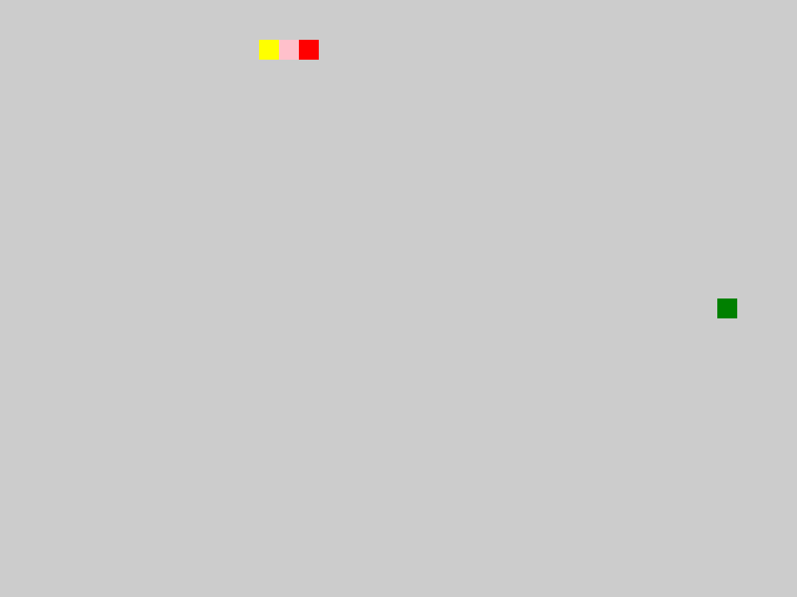
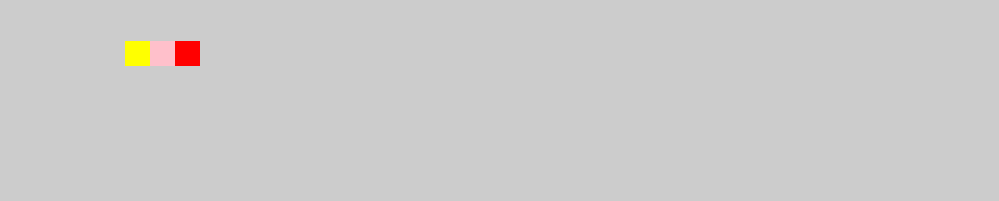
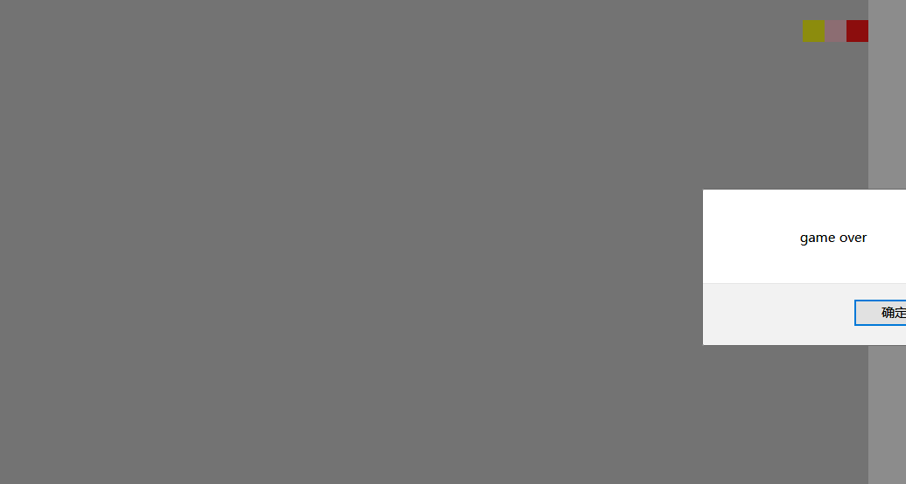
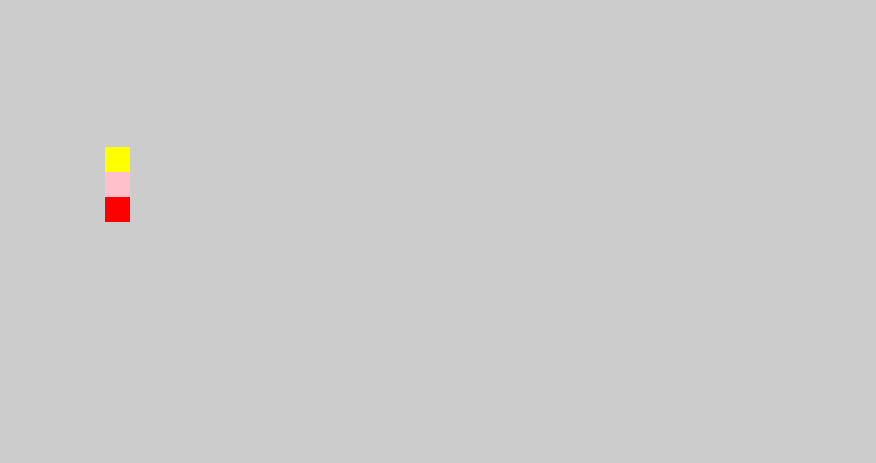
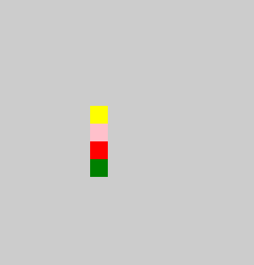

# -snake
贪吃蛇案例


##  1.方块和蛇头和蛇身显示

* 图片
  * 


### 1.1代码片段

####  1.1.1食物food显示


```
   var Food = function (x, y, color, width, height) {
        this.x = x || 20;
        this.y = y || 20;
        this.color = color || 'green';
        this.width = width || 20;
        this.height = height || 20;


    }
    Food.prototype.Render = function () {
        removeList(list);
        this.x = Math.floor(Math.random() * $('div').width() / this.width) * this.width;
        this.y = Math.floor(Math.random() * $('div').height() / this.height) * this.height;
        var p = $('<p></p>').css({
            position: 'absolute',
            width: this.width,
            height: this.height,
            left: this.x,
            top: this.y,
            backgroundColor: this.color
        }).appendTo($('div'))
        list.push(p);
        // console.log(x)
        // console.log(y)
    }
```

#### 1.1.2 蛇的snake显示

```
 var Snake = function (width, height, direction) {
        this.width = width || 20;
        this.height = height || 20;
        this.direction = direction || 'right'
        this.data = [{
            x: 3,
            y: 2,
            background: 'red'
        },
        {
            x: 2,
            y: 2,
            background: 'pink'
        },
        {
            x: 1,
            y: 2,
            background: 'yellow'
        },

        ]
    }
     Snake.prototype.Render = function () {
        var span;
        removePre(list);
        for (var i = 0; i < this.data.length; i++) {
            span = $('<span></span>').css({
                position: 'absolute',
                display: 'block',
                width: this.width,
                height: this.height,
                left: this.data[i].x * this.width,
                top: this.data[i].y * this.height,
                backgroundColor: this.data[i].background
            }).appendTo($('div'));
            list.push(span)
        }
        // console.log(list)


```


##  2.蛇动起来

+ 
  * 

### 2.1代码片段

```  
    var that;
    var Game = function (food, snake) {
        this.food = $.getFood;
        this.snake = $.getSake;
        that = this;
    }

    Game.prototype.star = function () {
        this.food.Render();
        this.snake.Render();
        animation();
        keydown();


    }
    function animation() {

        var timeId = setInterval(function () {
            this.snake.moving(this.food);
            if (this.snake.data[0].x < 0 || this.snake.data[0].x >= $('div').width() / this.snake.width
                || this.snake.data[0].y < 0 || this.snake.data[0].y >= $('div').height() / this.snake.height) {
                alert('game over');
                clearInterval(timeId);
                return;
            }
            this.snake.Render();
        }.bind(that), 500)
    }
```


##  3.边间判断

* 
  * 


####	3.1 代码片段

​	

``` 
 if (this.snake.data[0].x < 0 || this.snake.data[0].x >= $('div').width() / this.snake.width
                || this.snake.data[0].y < 0 || this.snake.data[0].y >= $('div').height() / this.snake.height) {
                alert('game over');
                clearInterval(timeId);
                return;
            }
```


##	 4.上下方向判断

* 

  * 

  ###  4.1代码片段

  ``` 
   function keydown() {
          $(document).on('keydown', function (e) {
              // console.log(e.keyCode)
              switch (e.keyCode) {
                  case 38:
                      if (this.snake.direction != 'bottom') this.snake.direction = 'top';
                      break;
                  case 40:
                      if (this.snake.direction != 'top') this.snake.direction = 'bottom';
                      break;
                  case 37:
                      if (this.snake.direction != 'right') this.snake.direction = 'left';
                      break;
                  case 39:
                      if (this.snake.direction != 'left') this.snake.direction = 'right';
                      break;
              }
          }.bind(that))
  
      }
  
  ```

  

##  5.吃到食物

* 
  * 

### 5.1 代码片段

```
  var oldData=this.data[this.data.length-1]

        if (this.data[0].x*this.width == food.x  && this.data[0].y*this.height == food.y) {

         this.data.push({
             x:oldData.x,
             y:oldData.y,
             background:getColor()
         })
          food.Render()
        }

```

